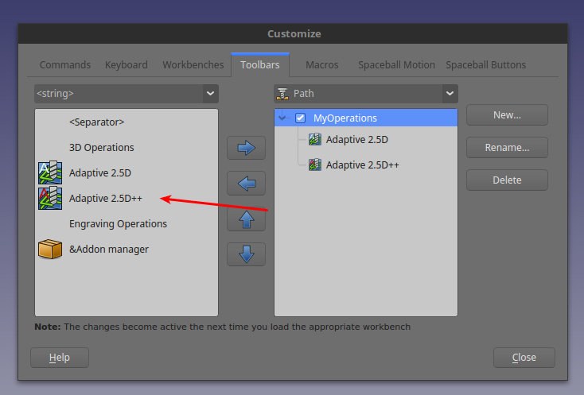
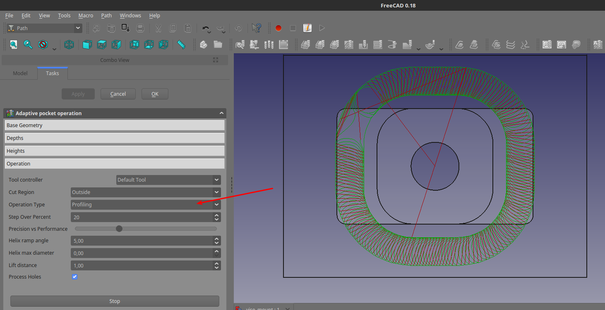
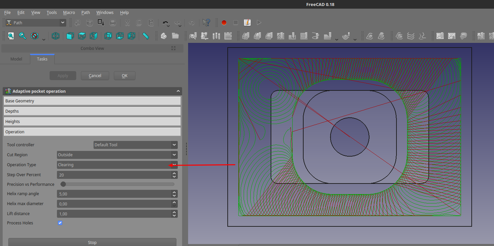
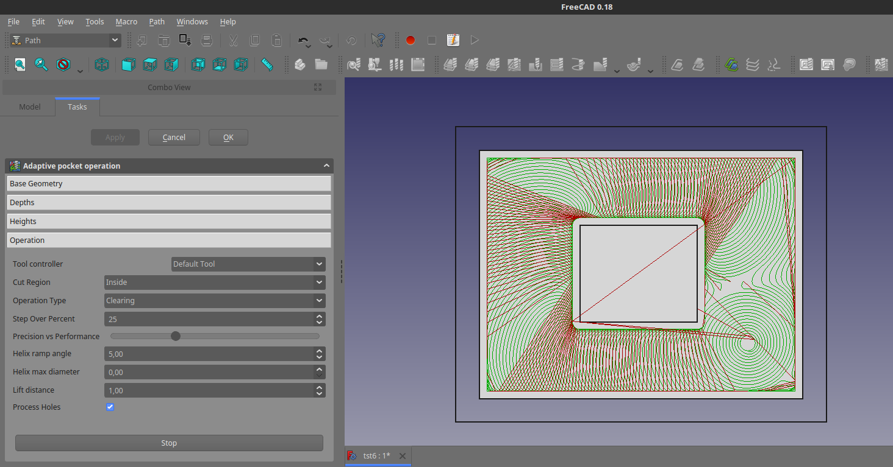
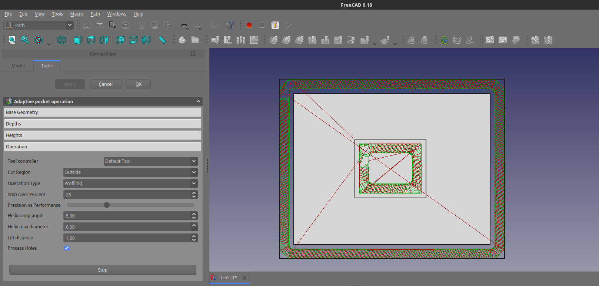

# Description

C++ version of FreeCAD_Mod_Adaptive_Path (see https://github.com/kreso-t/FreeCAD_Mod_Adaptive_Path).

Considerably faster and with added support for the adaptive profiling operation.

No longer depends on pyclipper (it uses cpp version of clipper lib included in the source).

# Installation (tested only on linux)

1. Clone the repo + build the C++ part

```bash
cd ~/.FreeCAD/Mod

git clone https://github.com/kreso-t/FreeCAD_Mod_Adaptive_Path-Cpp.git

cd FreeCAD_Mod_Adaptive_Path-Cpp

git submodule update --init --recursive

cmake -DPYTHON_EXECUTABLE=path/to/python ./cpp

make
```

2. (Re)start the FreeCAD and add command "Adaptive 2.5D++" to FreeCAD toolbar

  

# Screenshots

   New profiling option:
  

  

  

  